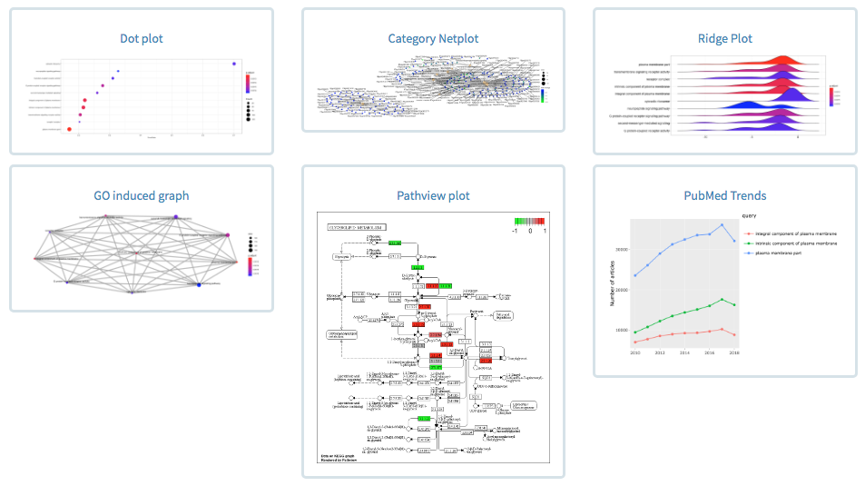

# ClusterProfShinyGSEA
- clusterProfiler Gene Set Enrichment Analysis R shiny
- This is a part of the NASQAR toolbox
- Pre-print: [NASQAR: A web-based platform for High-throughput sequencing data analysis and visualization](https://doi.org/10.1101/709980)

---

This is a web-based interactive application that wraps the popular <a href="https://bioconductor.org/packages/release/bioc/html/clusterProfiler.html" target="_blank"><strong>clusterProfiler</strong></a> package which implements methods to analyze and visualize functional profiles of genomic coordinates, gene and gene clusters.

Users can upload their own differential gene expression (DGE) data from <a href="https://bioconductor.org/packages/release/bioc/html/DESeq2.html" target="_blank"><strong>DESeq2</strong></a> or import data from the upstream <a href="http://nasqar.abudhabi.nyu.edu/deseq2shiny/" target="_blank"><strong>Deseq2Shiny</strong></a> app.

This app allows for quick and easy **Gene Set Enrichment Analysis (GSEA)** of GO-Terms and KEGG pathways.

It is meant to provide an intuitive interface for researchers to easily **upload and perform GSEA on RNA-seq data** interactively with no prior programming knowledge in R.

Visuals produced include dot plots, category net plots, enrichment map plots, GO induced graphs, gsea plots, and enriched KEGG pathway plots using the  <a href="https://bioconductor.org/packages/release/bioc/html/pathview.html" target="_blank"><strong>Pathview package</strong></a>.

The application follows this <a href="https://learn.gencore.bio.nyu.edu/rna-seq-analysis/gene-set-enrichment-analysis/" target="_blank">tutorial</a> <link>

See below for example output plots.

    

## **Input Data Types**

This application accepts the following types of input data:

### 1. Example data (Demo):

- For demo purposes, you can select "Example data"

- You can follow the steps afterwards to run the analysis mirroring the tutorial in order to get familiar with the app

### 2. Upload your own data (gene counts):

<ul>
<li>
A .csv/.txt file that contains a <strong>table of differential gene expression (DGE) data</strong>
</li>
<li>
Eg. the output of DESeq2 
</li>
<li>
The file can be either <strong>comma or tab delimited</strong>
</li>
<li>
The required columns are <strong>Gene name/id, Log2 Fold Change, p-adjusted values </strong>
</li>
<li>
You will have to select the column names that match the above required columns </strong>
</li>
<li>
For a sample file, click <a href="www/exampleData/drosphila_example_de.csv" target="_blank">here</a>
</li>
</ul>

<strong><em>Figure 2: Eg. DGE data file</em></strong>

    

## **Run Results**

### 1. Data Output
The output results will be either displayed and/or is downloadable
- EnrichGo results table
- EnrichKEGG results table

### 2. Visualization
Various forms of visualizations are included for either Go/KEGG:

* Bar Plot
* Dot Plot
* Enrichment Plot Map
* Enriched GO induced graph (goplot, GO only)
* Enriched GO induced graph (cnetplot)
* Pathview Plots (KEGG)

## Acknowledgements:

- [GuangchuangYu/clusterProfiler](https://github.com/GuangchuangYu/clusterProfiler)

- [Mohammed Khalfan - Gene Set Enrichment Tutorial](https://learn.gencore.bio.nyu.edu/rna-seq-analysis/gene-set-enrichment-analysis/)

